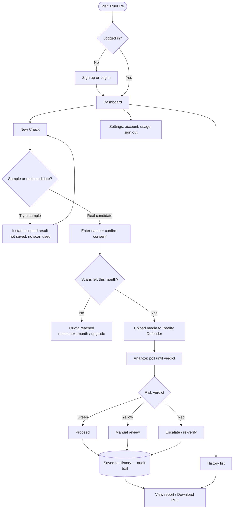

# TrueHire — User Flow

> How a recruiter / security user moves through the product, end to end.
> **Generated:** 2026-06-20

---

## Flowchart (Mermaid — renders on GitHub & most Markdown viewers)



---

## Plain-language walkthrough

1. **Arrive → Auth gate.** Visiting any page redirects to **Log in** unless a valid session cookie exists. New users **Sign up** (name, company, email, password). Passwords are hashed (bcrypt); a secure, http-only session cookie is issued.

2. **Dashboard.** The home screen shows four stats — Total checks, High risk, Needs review, Scans left this month — plus a table of recent checks and a prominent **New check** button.

3. **New Check.** Two ways to run:
   - **Sample candidate** (Alex / Jordan / Sam / Casey): an instant, scripted result for demos. *Not* saved, *no* scan used.
   - **Real candidate:** drop in an image or voice clip, optionally add the candidate's name, and **confirm consent** (required — biometric checks need it).

4. **Quota check.** Before a real scan runs, the app checks the monthly cap (protects the free Reality Defender tier). If exhausted, it blocks cleanly until next month.

5. **Analyze.** The file is uploaded to Reality Defender; the app polls until the verdict settles, then shows a **green / yellow / red** report with a risk score and per-model signals.

6. **Decide (human-in-the-loop).**
   - 🟢 **Green** → Proceed.
   - 🟡 **Yellow** → Manual review.
   - 🔴 **Red** → Escalate / re-verify.
   TrueHire is a *fraud signal*, never an automated hiring decision.

7. **Saved to History.** Every real check is persisted as a compliance-grade **audit trail** — viewable any time, with a downloadable PDF report.

8. **Settings.** Account details, usage, security/compliance notes, and sign out.

---

## ASCII fallback

```
Visit ──> [Logged in?] ──No──> Sign up / Log in ──┐
              │ Yes                                │
              └──────────────> Dashboard <─────────┘
                                  │
                                  ├──> New Check ──> [Sample?] ──Yes──> Scripted result (not saved)
                                  │                      │No
                                  │                      v
                                  │                 Name + Consent ──> [Quota left?] ──No──> Blocked
                                  │                                          │Yes
                                  │                                          v
                                  │                                 Upload → Reality Defender → Verdict
                                  │                                          │
                                  │                        ┌────────┬────────┴────────┐
                                  │                       Green    Yellow            Red
                                  │                      Proceed   Review          Escalate
                                  │                        └────────┴────────┬────────┘
                                  │                                          v
                                  ├──> History  <───────────────  Saved (audit trail) ──> Report / PDF
                                  └──> Settings (account, usage, sign out)
```
